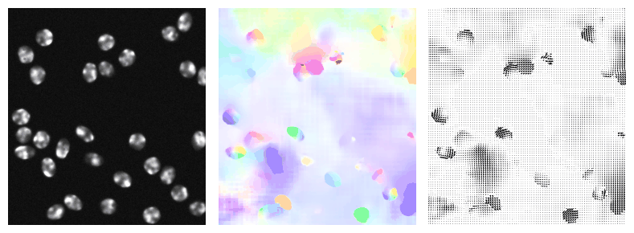

# Optical flow estimation in Python

A Python package for optical flow estimation, combining classical and deep learning approaches.

<p align="center">
  
  <br />
  <sub><em>SEA-RAFT flow on the <code>Fluo-N2DH-SIM+</code> sequence from the <a href="https://celltrackingchallenge.net/">Cell Tracking Challenge</a> — see <code>notebooks/cell_migration_demo.ipynb</code>.</em></sub>
</p>

The variational methods are a largely a Python reimplementation of the MATLAB codebase (https://cs.brown.edu/people/mjblack/code.html) from Sun, Roth, and Black, *"Secrets of Optical Flow Estimation and Their Principles"* (CVPR 2010), with the addition of an implementation of the Lucas-Kanade local method. The deep learning methods include RAFT, SEA-RAFT, and WAFT (vendored from Princeton Vision & Learning Lab). 

This repository contains two packages:

- **`optical_flow`** -- Python/SciPy implementation of all methods (variational + deep learning).
- **`flow_fast`** -- Drop-in replacement using Numba JIT, OpenCV, and an optimized PCG solver for variational methods. Deep learning methods are shared with `optical_flow`.


## Features

### Classical Methods
- **Lucas-Kanade (LK)** -- Local window-based method with Gaussian-weighted structure tensor
- **Horn-Schunck (HS)** -- Laplacian spatial regularization
- **Black-Anandan (BA)** -- Robust penalties with GNC optimization
- **Classic+NL** -- Non-local term with color-guided weighted median filtering
- **Alternative BA (Alt-BA)** -- Auxiliary flow field with Li-Osher denoising
- 10 robust penalty functions (quadratic, lorentzian, charbonnier, generalized charbonnier, Geman-McClure, Huber, Tukey biweight, Gaussian, Student-t, unnormalized Student-t)
- Complete pipeline: Gaussian image pyramids, ROF structure-texture decomposition, Hermite bicubic interpolation, IRLS optimization, sparse linear system solvers (PCG, direct, SOR), occlusion detection, weighted median filtering

### Deep Learning Methods (optional, requires PyTorch)
- **RAFT** (Teed & Deng, ECCV 2020) -- Recurrent All Pairs Field Transforms
- **SEA-RAFT** (Wang, Lipson & Deng, ECCV 2024) -- Simple, Efficient, Accurate RAFT
- **WAFT** (Wang & Deng, ICLR 2026) -- Warping-Alone Field Transforms
- Multiple pretrained checkpoint variants per method (see [Model Weights](#model-weights))
- Auto-download of weights on first use

### Utilities
- **Middlebury .flo I/O:** read and write standard .flo flow files
- **Visualization:** Middlebury color coding, quiver plots, magnitude maps, HSV encoding
- **Evaluation metrics:** Average Angular Error (AAE) and Average Endpoint Error (AEPE)

### `flow_fast` Acceleration Backends
- Numba `@njit(parallel=True)` for weighted median, ROF denoising, penalty functions, bicubic interpolation
- OpenCV for image warping (`cv2.remap`), filtering (`cv2.filter2D`), pyramid construction (`cv2.resize`)
- PCG solver with Jacobi preconditioner (replaces SuperLU `spsolve`)
- Optional CHOLMOD direct solver via scikit-sparse

## Installation

```bash
cd flow_code_python
pip install -e ".[fast]"
```

This installs both `optical_flow` and `flow_fast` with all dependencies. To install only the base package:

```bash
pip install -e .
```

For deep learning methods (RAFT, SEA-RAFT, WAFT):

```bash
pip install -e ".[deep]"
```

For everything (fast + deep + dev):

```bash
pip install -e ".[fast,deep,dev]"
```

## Quick Start

```python
import numpy as np
from PIL import Image

# Load two consecutive frames
im1 = np.array(Image.open('frame1.png')).astype(float)
im2 = np.array(Image.open('frame2.png')).astype(float)

# --- Variational (recommended default) ---
from flow_fast import estimate_flow, flow_to_color, plot_flow
uv = estimate_flow(im1, im2, method='classic+nl-fast')

# --- Deep learning (works with both optical_flow and flow_fast) ---
uv = estimate_flow(im1, im2, method='raft')       # RAFT
uv = estimate_flow(im1, im2, method='sea-raft')    # SEA-RAFT
uv = estimate_flow(im1, im2, method='waft')        # WAFT

# All methods return (H, W, 2): uv[:,:,0] = horizontal, uv[:,:,1] = vertical

# Visualize
color_img = flow_to_color(uv)
ax = plot_flow(uv, style='color')
```

Model weights are downloaded automatically on first use (see [Model Weights](#model-weights)).

## Available Methods

### Classical Methods

| Method Name | Description |
|---|---|
| `'lk'` | Lucas-Kanade with Gaussian-weighted structure tensor |
| `'classic+nl-fast'` | Classic+NL with reduced iterations (recommended) |
| `'classic+nl'` | Classic+NL with texture decomposition and weighted median |
| `'classic+nl-full'` | Classic+NL with full weighted median version |
| `'hs'` | Horn-Schunck with ROF texture constancy |
| `'hs-brightness'` | Horn-Schunck with brightness constancy |
| `'ba'` / `'classic-l'` | Black-Anandan with lorentzian, texture |
| `'ba-brightness'` | Black-Anandan with brightness constancy |
| `'classic-c'` | Classic with charbonnier penalties, texture |
| `'classic-c-brightness'` | Classic with charbonnier, brightness |
| `'classic++'` | Classic++ with generalized charbonnier, bi-cubic interpolation |
| `'classic-c-a'` | Alt-BA with charbonnier penalties |

### Deep Learning Methods

Requires `pip install optical_flow[deep]`. Works with both `optical_flow` and `flow_fast`.

| Method Name | Description |
|---|---|
| `'raft'` | RAFT -- Recurrent All Pairs Field Transforms (Teed & Deng, 2020) |
| `'sea-raft'` | SEA-RAFT -- Simple, Efficient, Accurate RAFT (Wang et al., 2024) |
| `'waft'` | WAFT -- Warping-Alone Field Transforms (Wang & Deng, 2026) |

Select checkpoint variants via the `params` argument:

```python
# RAFT variants
uv = estimate_flow(im1, im2, method='raft', params={'model_name': 'raft-sintel'})
```

## Using Method Classes Directly

### Variational Methods

```python
from optical_flow.methods import HSOpticalFlow, BAOpticalFlow, ClassicNLOpticalFlow
from optical_flow.robust.robust_function import RobustFunction
import numpy as np

# Horn-Schunck
hs = HSOpticalFlow()
hs.lambda_ = 40
hs.texture = True
hs.images = np.stack([gray1, gray2], axis=2)
uv = hs.compute_flow(np.zeros((H, W, 2)))

# Black-Anandan with custom penalties
ba = BAOpticalFlow()
ba.rho_spatial_u = [RobustFunction('lorentzian', 0.03),
                    RobustFunction('lorentzian', 0.03)]
ba.rho_spatial_v = [RobustFunction('lorentzian', 0.03),
                    RobustFunction('lorentzian', 0.03)]
ba.rho_data = RobustFunction('lorentzian', 1.5)
ba.images = np.stack([gray1, gray2], axis=2)
uv = ba.compute_flow(np.zeros((H, W, 2)))
```

### Deep Learning Methods

```python
from optical_flow.methods.deep import RAFTFlow, SEARAFTFlow, WAFTFlow

# RAFT with Sintel-trained weights on GPU
model = RAFTFlow(model_name='raft-sintel', device='cuda', iters=24)
model._im1, model._im2 = im1, im2
uv = model.compute_flow()
```

## Loading and Evaluating Middlebury Sequences

```python
from optical_flow import estimate_flow, flow_angular_error
from optical_flow.io.flo_io import read_flow_file, read_flo, write_flo

# Load RubberWhale test sequence (images + ground truth)
im1, im2, tu, tv = read_flow_file('RubberWhale', 10)

# Estimate flow
uv = estimate_flow(im1, im2, method='classic+nl-fast')

# Compare against ground truth
aae, std_ae, aepe = flow_angular_error(tu, tv, uv[:,:,0], uv[:,:,1])
print(f'Average Angular Error: {aae:.2f} degrees')
print(f'Average Endpoint Error: {aepe:.3f} pixels')

# Read/write .flo files directly
flow = read_flo('ground_truth.flo')
write_flo(uv, 'output.flo')
```

## Visualization

```python
from optical_flow import plot_flow, flow_to_color
import matplotlib.pyplot as plt

fig, axes = plt.subplots(2, 2, figsize=(12, 10))

# Middlebury color coding
plot_flow(uv, style='color', ax=axes[0, 0])

# Quiver plot
plot_flow(uv, style='quiver', ax=axes[0, 1], step=8)

# Flow magnitude
plot_flow(uv, style='magnitude', ax=axes[1, 0])

# HSV encoding (hue=direction, value=magnitude)
plot_flow(uv, style='hsv', ax=axes[1, 1])

plt.tight_layout()
plt.savefig('flow_visualization.png')
```

## Running Tests

```bash
# Install development dependencies
pip install -e ".[dev]"

# Run all tests
pytest

# Run with verbose output
pytest -v

# Run a specific test file
pytest tests/test_derivatives.py
```

82 tests cover robust functions, .flo I/O, sparse operators, image derivatives, pyramid construction, evaluation metrics, and integration tests for each method (HS, BA, Classic+NL).


## Package Structure

```
flow_code_python/
├── setup.py
├── requirements.txt
├── optical_flow/               # Original Python port (scipy-based)
│   ├── __init__.py
│   ├── interface.py            # estimate_flow() high-level API
│   ├── methods/                # LK, HS, BA, Classic+NL, Alt-BA
│   │   └── deep/              # Deep learning methods
│   │       ├── _base.py       # DeepFlowBase ABC
│   │       ├── raft.py        # RAFTFlow wrapper
│   │       ├── sea_raft.py    # SEARAFTFlow wrapper
│   │       ├── _model_cache.py # Auto-download and caching
│   │       └── _vendor/       # Vendored inference code
│   │           ├── raft/
│   │           ├── sea_raft/
│   │           └── waft/      # Includes DepthAnythingV2 + DINOv2
│   ├── robust/                 # Penalty functions + RobustFunction
│   ├── utils/                  # Derivatives, pyramid, warping, weighted median
│   ├── io/                     # .flo file I/O
│   ├── viz/                    # Flow visualization
│   └── evaluation/             # AAE, EPE metrics
├── flow_fast/                  # Accelerated version (same API)
│   ├── __init__.py
│   ├── interface.py            # Same estimate_flow() API (DL methods delegate to optical_flow)
│   ├── methods/                # Same variational methods, wired to fast backends
│   ├── _accel/                 # Numba JIT kernels (weighted median, ROF, etc.)
│   ├── solvers/                # PCG + CHOLMOD solver dispatch
│   ├── robust/                 # Numba-accelerated penalty functions
│   ├── utils/                  # OpenCV-based derivatives, pyramid, warping
│   ├── io/                     # .flo file I/O (unchanged)
│   ├── viz/                    # Flow visualization (unchanged)
│   └── evaluation/             # AAE, EPE metrics (unchanged)
├── data/                       # Middlebury sequences
│   ├── other-data/             # Image pairs (frame10.png, frame11.png)
│   └── other-gt-flow/          # Ground truth flow (.flo files)
├── notebooks/                  # Demo notebooks (optical_flow + flow_fast versions)
└── tests/                      # Unit and integration tests
```

## References

- B.D. Lucas and T. Kanade. "An Iterative Image Registration Technique with an Application to Stereo Vision." *IJCAI*, 1981.
- D. Sun, S. Roth, and M. J. Black. "Secrets of Optical Flow Estimation and Their Principles." *CVPR*, 2010.
- B. Horn and B. Schunck. "Determining Optical Flow." *Artificial Intelligence*, 1981.
- M. J. Black and P. Anandan. "The Robust Estimation of Multiple Motions." *CVIU*, 1996.
- S. Baker et al. "A Database and Evaluation Methodology for Optical Flow." *IJCV*, 2011.
- Z. Teed and J. Deng. "RAFT: Recurrent All-Pairs Field Transforms for Optical Flow." *ECCV*, 2020.
- Y. Wang, L. Lipson, and J. Deng. "SEA-RAFT: Simple, Efficient, Accurate RAFT for Optical Flow." *ECCV*, 2024.
- Y. Wang and J. Deng. "WAFT: Warping-Alone Field Transforms for Optical Flow." *ICLR*, 2026.

## License

The variational methods (`optical_flow`, `flow_fast`) are provided for **research purposes only**, consistent with the original MATLAB release from Brown University. **Commercial use is strictly prohibited.** See [LICENSE](LICENSE).

The vendored deep learning code for **RAFT, SEA-RAFT, WAFT** is from Princeton Vision & Learning Lab under the **BSD 3-Clause License**. 

## Citations

If you use this code in your research, please cite the relevant papers:

```bibtex
@inproceedings{lucas1981iterative,
  title={An Iterative Image Registration Technique with an Application to Stereo Vision},
  author={Lucas, Bruce D and Kanade, Takeo},
  booktitle={International Joint Conference on Artificial Intelligence (IJCAI)},
  year={1981}
}

@inproceedings{sun2010secrets,
  title={Secrets of optical flow estimation and their principles},
  author={Sun, Deqing and Roth, Stefan and Black, Michael J},
  booktitle={IEEE Conference on Computer Vision and Pattern Recognition (CVPR)},
  year={2010}
}

@inproceedings{teed2020raft,
  title={{RAFT}: Recurrent All-Pairs Field Transforms for Optical Flow},
  author={Teed, Zachary and Deng, Jia},
  booktitle={European Conference on Computer Vision (ECCV)},
  year={2020}
}

@inproceedings{wang2024searaft,
  title={{SEA-RAFT}: Simple, Efficient, Accurate {RAFT} for Optical Flow},
  author={Wang, Yihan and Lipson, Lahav and Deng, Jia},
  booktitle={European Conference on Computer Vision (ECCV)},
  year={2024}
}

@inproceedings{wang2026waft,
  title={{WAFT}: Warping-Alone Field Transforms for Optical Flow},
  author={Wang, Yihan and Deng, Jia},
  booktitle={International Conference on Learning Representations (ICLR)},
  year={2026}
}
```
